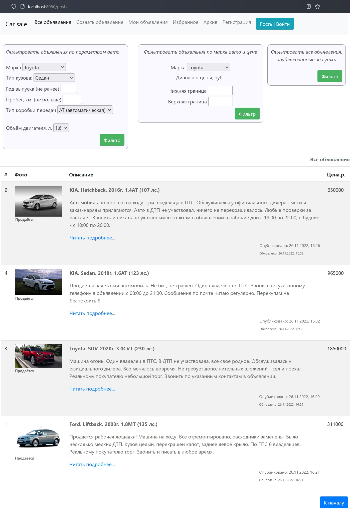
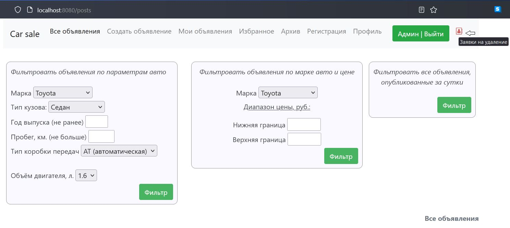
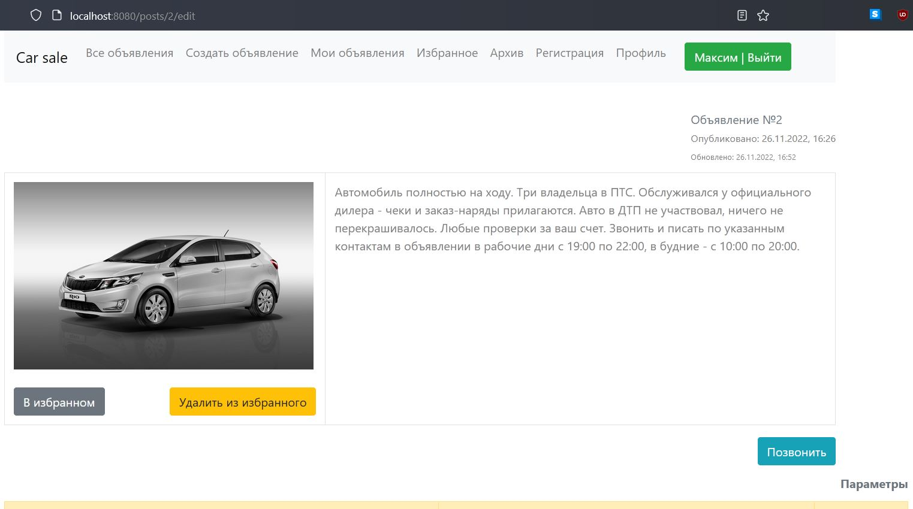
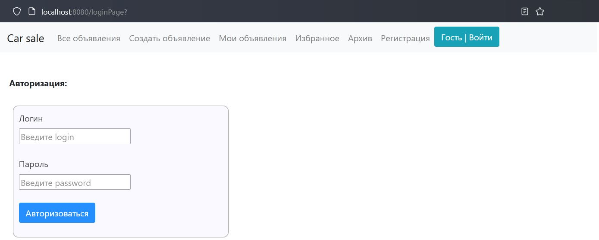
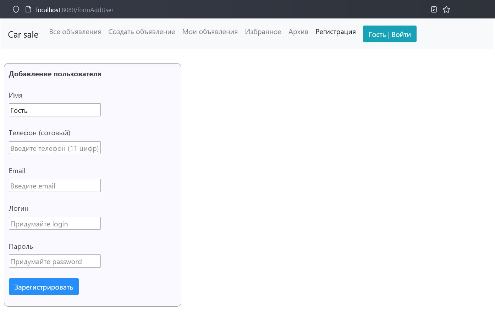
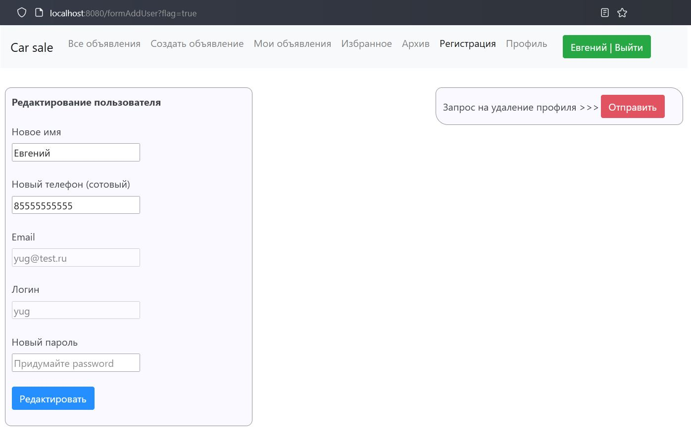
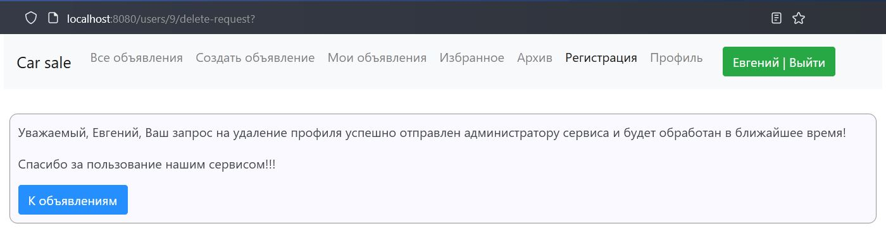
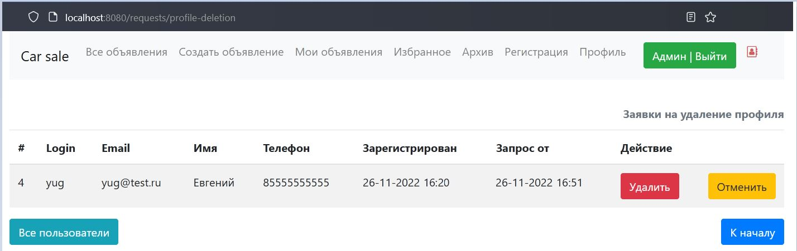
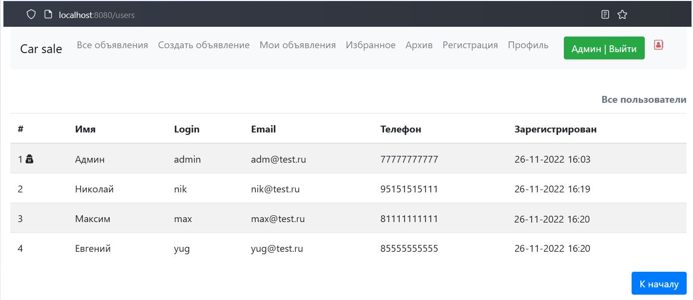

Это учебный проект по разработке сайта по продаже машин.

Возможности сайта:
- На сайте должны быть объявления.
    - В объявлении должно быть:
        - описание,
        - марка машины,
        - тип кузова,
        - фото,
        - статус продано или нет.
- Объявление, имеющее статус Продано, попадает во вкладку Архив.
- Поиск объявлений реализован в виде фильтров:
    - фильтрация объявлений по параметрам авто;
    - фильтрация объявлений по марке авто и диапазону цены;
    - фильтрация объявлений, опубликованных за сутки.

- Зарегистрированный пользователь имеет возможность:
  - Редактировать информацию в Профиле,
  - Оставлять заявку администратору сайта для удаления своего профиля,
  - Создавать и редактировать объявления,
  - просматривать в объявлении контакты продавца,
  - просматривать в объявлении историю владений авто и динамику изменения цены,
  - добавлять объявление в Избранное,
  - удалять объявление из Избранного.
  

- Дополнительно реализован функционал администратора сайта:
  - возможность удаления объявления (ий), помеченного как архивное,
  - возможность удаления профиля пользователя сайта по запросу.

Вид главной страницы приложения для пользователя сайта в роли User

Вид главной страницы приложения для пользователя сайта в роли Admin

Вид главной страницы приложения с примененной фильтрацией объявлений по параметрам авто

Вид главной страницы приложения с примененной фильтрацией объявлений по марке авто и диапазону цены

Вид главной страницы приложения с примененной фильтрацией объявлений, опубликованных за сутки

Вид страницы объявления для незарегистрированного пользователя

Вид страницы объявления для зарегистрированного пользователя

Вид страницы создания нового объявления (для зарегистрированного пользователя)

Вид страницы редактирования объявления (для зарегистрированного пользователя)

Вид страницы собственного объявления

Вид страницы объявления, добавленного в Избранное

Вид страницы c избранными объявления

Вид страницы с архивными объявлениями

Вид страницы с архивными объявлениями для пользователя сайта в роли Администратор (login = admin)

Вид страницы аутентификации пользователя

Вид страницы регистрации нового пользователя

Вид страницы редактирования профиля пользователя

Вид страницы подтверждения отправки запроса на удаление Профиля пользователя

Вид страницы со всеми заявками на удаление Профилей пользователей (admin)

Вид страницы со всеми зарегистрированными пользователями на сайте (admin)

Используемые технологии в проекте:
- Spring boot.
- Thymeleaf.
- Bootstrap.
- Hibernate.
- Lombok.
- СУБД: PostgreSQL.